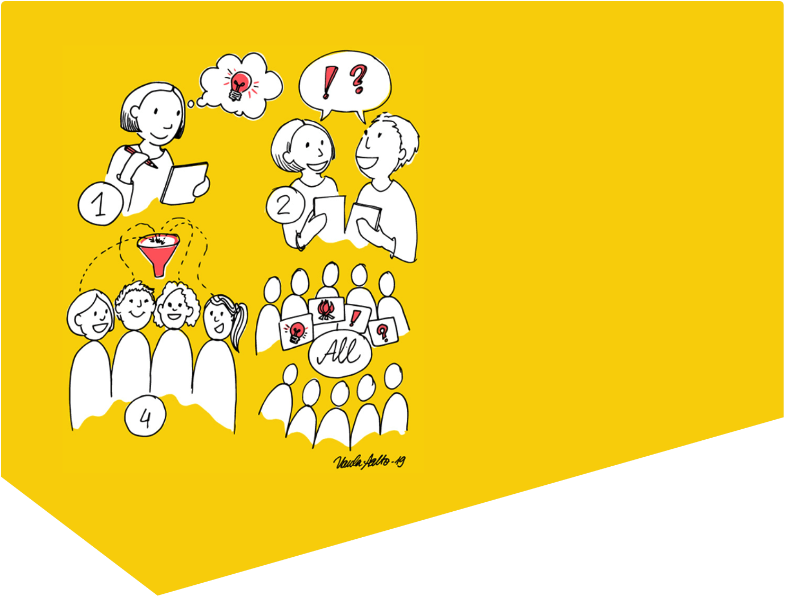

## Inspirationen kurz vor dem Endspurt
Das XCamp lebt von vielseitigen Themenbeiträgen und dem intensiven Austausch zu diesen. Du hast bereits ein Thema für
eine Session, weißt aber noch nicht so recht, wie Du Dein Thema am besten präsentierst?

Grundsätzlich steht das gesamte Spektrum von Formaten zur Auswahl, die für 45 Minuten geeignet sind. Wir haben elf
dieser Methoden visualisiert und kurz zusammengefasst. Sie können alle genutzt werden, um die Mitwirkung gut zu
strukturieren. Als Session-Geber kannst du das von dir gewünschte Format vorgeben. Sinnvoll ist es, allen
Session-Teilnehmern die Regeln zu Beginn kurz in Erinnerung zu rufen.

Wir veröffentlichen die Methoden in lockerer Folge hier im Blog. Fortsetzung folgt in Kürze.
<!--snip-->

## Teil 1:

- [Fishbowl](#fishbowl)
- [1-2-4-All (Liberating Structure)](#liberating-structure)
- [Ask Me Anything](#ask-me-anything)

## Fishbowl
Die Methode eignet sich für große Gruppen mit potentiell hitzigen Diskussionen. Der Kern der Methode ist die Sitzordnung.

Ein Kreis von 4-6 Stühlen steht in der Mitte (Fishbowl). Um diesen inneren Kreis werden alle anderen Stühle für die
zuhörenden Teilnehmer bereitgestellt.

Nur die Teilnehmer im inneren Stuhlkreis sprechen. Es redet immer nur „Einer“. Keine Parallelgespräche!

Im inneren Kreis bleibt stets ein Stuhl frei, den ein Teilnehmer aus dem Außenkreis einnehmen kann, der mitsprechen will.

Dafür verlässt eine Person, z.B. wer nicht mehr an der aktiven Diskussion teilnehmen möchte, den inneren Stuhlkreis.

Große Gruppen können auf dieses Weise gut strukturiert diskutieren und zu einem Ergebnis kommen.

## 1-2-4-All (Liberating Structure)
Ganz leichtgewichtig **in vier Schritten** innerhalb kürzester Zeit vielfältige Ergebnisse zu einer Fragestellung erhalten:

Jeder Einzelne macht sich für sich selbst eine Minute lang Gedanken zur gestellten Frage.

Als Nächstes werden diese Einzelmeinungen binnen zwei Minuten in Zweier-Teams diskutiert.

In Vierer-Gruppen werden die Aspekte der Fragestellung aus den Zweier-Teams während vier Minuten konsolidiert.

Schließlich kommen alle in großer Runde zusammen und teilen ihre Gedanken zur Fragestellung in fünf Minuten.

Vorteil: Alle Teilnehmer werden sofort eingebunden – auch die Zurückhaltenden – und jede Runde bereichert die Lösungsideen.

## Ask Me Anything
Ein Spezialist trägt nicht frontal seine Expertise in einem Vortrag dem Publikum vor, sondern stellt sich aktiv in einem
Interview-Format einer Gruppe.

Am Anfang steht ein kurzer Impulsvortrag von maximal 3 Minuten.

Die Teilnehmer bekommen 3 Minuten Zeit, Fragen zum Impulsvortrag zu formulieren. Jeder darf max. 3 Fragen stellen.

Die Fragen werden ans Whiteboard gepinnt und geclustert.

Der Spezialist beantwortet die Fragen in einer selbst gewählten Reihenfolge.

Vorteil: Lockert ein Thema auf, involviert das Publikum aktiv, der Spezialist kann sich optimal auf den Wissensstand der
Teilnehmer einstellen. Sehr lean. Allgemeinplätze oder die dem Hörerkreis bekannte Grundlagen werden ausgespart.

## Andere Teile

[Teil 2: Kollegiale Beratung, Speed Dating, Hands-on Workshop](blog/2019-09-09-damit-deine-session-ein-benefit-fuer-dich-und-das-xcamp19-wird-2-2)
[Teil 3: Ja+Und Brainstorming, Mind-Mapping, Studio Walk](blog/2019-09-09-damit-deine-session-ein-benefit-fuer-dich-und-das-xcamp19-wird-3)
