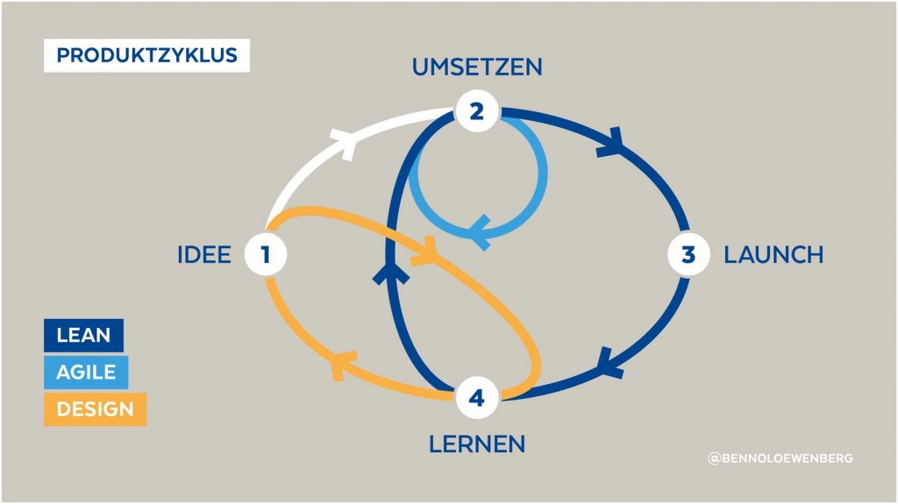
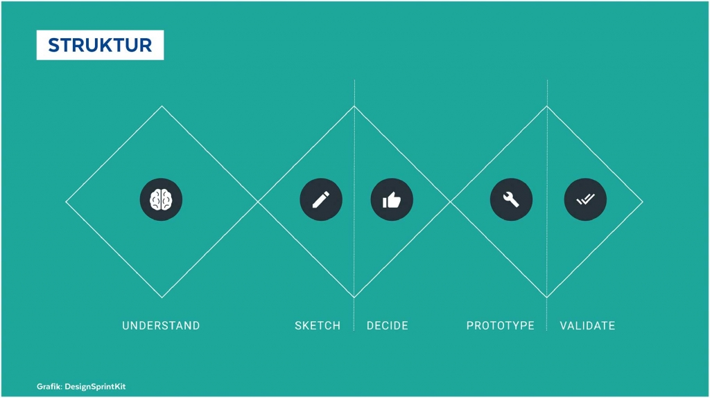

Kundenprobleme verstehen, Ideen für passende Lösungen entwickeln und herausfinden, wie gut jene Ideen tatsächlich sind – 
all das in kurzer Zeit: Charakteristika und Einsatzmöglichkeiten der Design Sprint-Methode von Google im Vergleich und 
Zusammenspiel mit Design Thinking-Methoden und Lean Startup.

##Positiver Zeitdruck

Google Design Sprint ist eine Design-Methode zur Lösung von Business-Problemen, um schnell Ideen zu entwickeln und direkt 
ein Bild über deren Marktfähigkeit zu erhalten – bevor viel Zeit, Geld und Arbeit in ein Produkt investiert wurde.

Es ist eine Kombination von Methodenbestandteilen aus Design Thinking, Creative Problem Solving, User-Research sowie 
produktstrategischer Aspekte (und es schmeckt auch ein bisschen nach Lean). Dieser Methodenkoffer wird stetig 
weiterentwickelt und immer wieder an die jeweilige Aufgabe und Fähigkeiten des Teams angepasst. Im Unterschied 
zu Design Thinking sind Design Sprints v. a. auf digitale Produkte ausgerichtet. Im Unterschied zu Lean Startup 
ziehen Design Sprints Erkenntnisse einzig aus einfachen Prototypen.

Charakteristisch für Design Sprints sind die fortwährend erzeugten letzten Minuten, ohne die bekanntlich viele Dinge 
erst gar nicht fertiggestellt werden würden. So ist jeder Arbeitsschritt ganz klar zeitlich knapp begrenzt („Time Boxed“)

##Flexibler Rahmen

Ebenso gibt es eine feste Struktur, die im Wesentlichen dem Design Thinking entlehnt wurde. Die fünf Phasen des Design 
Sprint wurden ursprünglich auf fünf Tage verteilt. Die Praxis hat gezeigt, dass sich dies eher selten auch genau so 
durchführen lässt, weswegen auch Google bzw. prominente Protagonisten selbst von dieser spezifisch festgelegten Dauer 
abgerückt sind („Design Sprint 2.0“).

Zudem sind erfolgreiche Design Sprints eigentlich ein Etikettenschwindel, da jene nicht bloß in nur ein paar Tagen 
vonstatten gehen: Von zentraler Bedeutung für das Gelingen ist deren Vorbereitung, welche durchaus sehr viel mehr Zeit 
in Anspruch nehmen kann als der eigentliche Design Sprint selbst. Diese beinhaltet neben allem Organisatorischem, v. a. 
das Verstehen des Problemfeldes und der daraus abgeleiteten Formulierung der zu lösenden Problemstellung („Problem Framing“) 
sowie den dafür notwendigen Nutzerrecherchen als Grundlage.

##Machen und Verwerfen

Für jedes Team und jede Aufgabe wird ein Design Sprint mit einer darauf abgestimmten Auswahl an Hilfsmitteln gefahren. 
Auch während dessen Durchführung nimmt der Sprint Master, je nach Dynamik und Zwischenergebnissen, „on-the-fly“ Anpassungen 
vor.

Für Design Sprints geeignete, leichtgewichtige Brainstorming-/Ideation-Werkzeuge haben gemein, dass sie sich schnell und 
unkompliziert anwenden lassen und immer nach vorne gerichtet sind. Dies beinhaltet die Verwendung einfachster (Büro)Materialien und stets lösungsorientierter Herangehensweisen, um in kurzer Zeit möglichst viele Ergebnisse produzieren zu können (z. B. „Crazy 8s“ und „How Might We“).

Ein wichtiger Teil von Design Sprints sind schnell erstellte Prototypen. Jene machen, die während des Design Sprints 
entstandenen Ideen anfass – und überprüfbar. Sie sind kein Selbstzweck, sondern Wegwerfartikel, die nur gerade so gut 
ausgearbeitet sein müssen, um beim Verproben mit Probanden ein Produkterlebnis zu schaffen, das realistisch genug für 
aussagekräftige Ergebnisse ist („Rapid Prototyping“).

##Vielseitig und vielschichtig

Wie bei allen Human-Centered Design Methoden spielt eine möglichst vielfältig aufgestellte Teilnehmergruppe eine wichtige 
Rolle, damit die verschiedenen Blickwinkel zu einem Problemfeld und unterschiedliche Denkweisen für Lösungsansätze im 
Team vorhanden sind. Jenes Know-how, welches nicht im Team vertreten ist, wird durch entsprechende Kurzvorträge externer 
Personen an die Teilnehmer herangetragen („Lightning Talks“).

Um bei aller Dynamik nicht den (roten) Faden zu verlieren, bedient man sich Orientierungshilfen wie dem „Challenge Statement“. 
Hierin werden die aus der Vorbereitungsphase stammenden Ziele und Erkenntnisse aufgeführt und im Laufe des Design Sprints um 
den erarbeiteten Lösungsansatz ergänzt.

Anwendbar sind Design Sprints in zwei Flughöhen: auf strategischer Ebene für langfristige Fragestellungen wie Produktvisionen, 
als auch auf operativer Ebene, um bspw. während der Produktentwicklung Einzelaspekte, z. B. Produkt-Features, zu überprüfen 
und zu optimieren.

##Fazit

Design Sprints ermöglichen es innerhalb kurzer Zeit Kundenanforderungen aus unterschiedlichen Blickwinkeln identifizieren 
und betrachten zu können. Ebenso mehrere mögliche Lösungen zu generieren und diese frühzeitig, mit echten Nutzern zu 
überprüfen. Dies hilft eine klare Vorstellung über die Marktgängigkeit vor Entwicklung und Produktion einer Lösung zu erlagen.

##Tipps und Infos

Mehr Details z. B. zu den einzelnen Phasen, weiterführende Informationen, hilfreiche Hinweise und Werkzeuge finden sich hier:

Design Sprints, kurz knackig und komplett präsentiert: 
[https://speakerdeck.com/bennoloewenberg/google-design-sprint-deutsch-number-googlede](https://speakerdeck.com/bennoloewenberg/google-design-sprint-deutsch-number-googlede)

Aktuelle Meldungen und Beiträge zu Design Sprints und artverwandten Methoden: [https://twitter.com/BennoLoewenberg](https://twitter.com/BennoLoewenberg)

Hilfestellungen zur Durchführung von Design Sprints:
[https://designsprintkit.withgoogle.com/](https://designsprintkit.withgoogle.com/)

##Über den Autor: Benno Löwenberg

Benno Löwenberg optimiert als strategischer Berater die digitalen Kontaktpunkte von Produkten und Dienstleistungen mit 
deren Nutzern. Er formt digitale Lösungen von Expertensystemen bis interaktiven Installationen v. a. in den Bereichen 
Enterprise UX, Industrial UX, Medical UI. Er ist Google Dev Expert für Product Design (Product Strategy, UX, UI Design) 
und zudem Google Design Sprint Master.

##Erlebe Benno Löwenberg auf dem XCamp 
Auf dem XCamp erwartet Dich, neben zahlreichen weiteren spannenden Sessions, Benno Löwenberg mit einer Session zum 
Thema “Design-Systeme: UX skalierbar machen (Designer und Devs als Speed-Hero statt Sprint-Sisyphos)”. [Sicher Dir 
jetzt Dein Ticket](https://xcamp.co/netvis/tickets?type=private).

