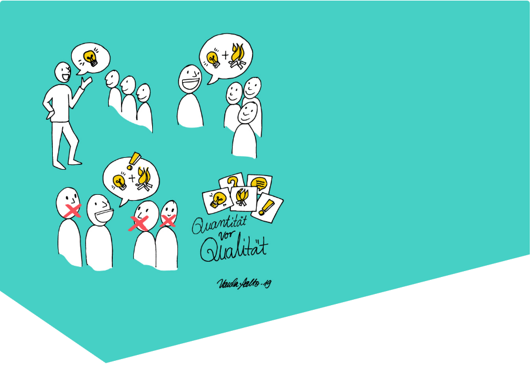
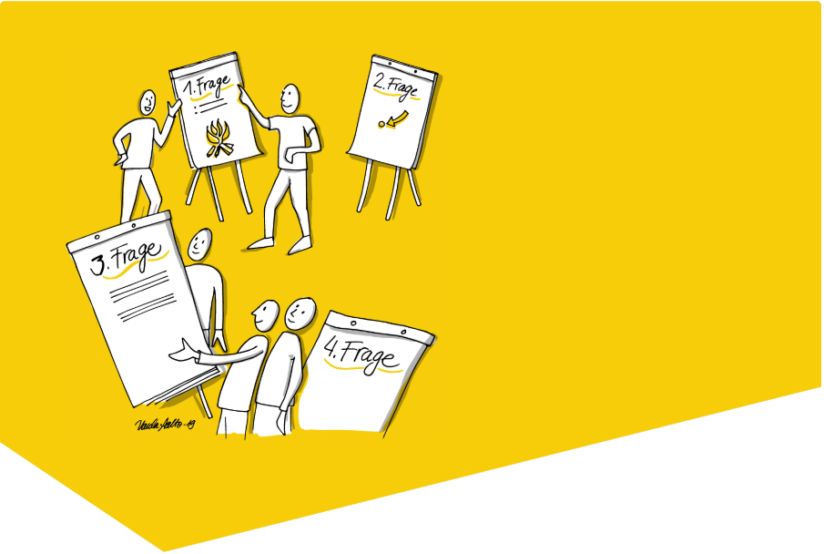
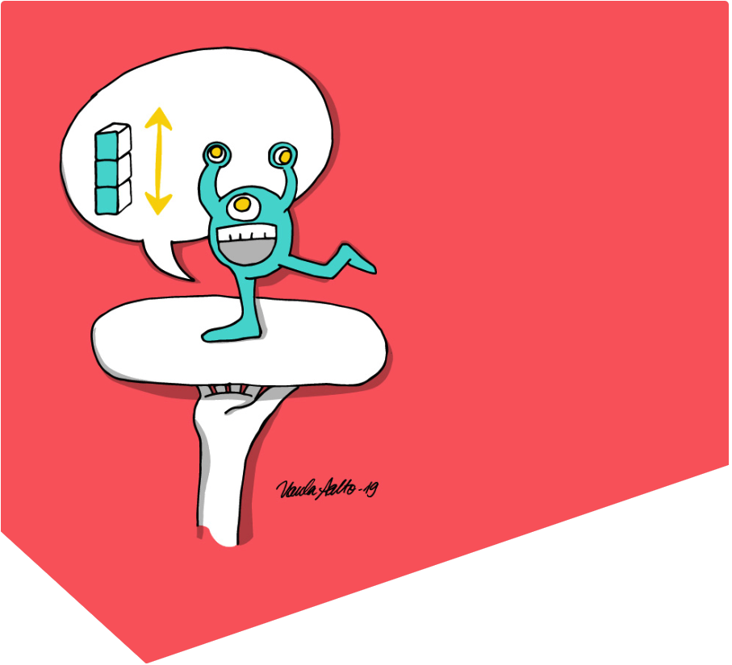

## Inspirationen kurz vor dem Endspurt
Wir haben für dich 10 Methoden visualisiert und kurz zusammengefasst, welche dir hier im XCamp, aber auch im beruflichen Alltag helfen können. Zur Auswahl steht das gesamte Spektrum von Formaten, die bequem in 45 Minuten passen. Für all diese Methoden gelten einfache Regeln, die der Moderator – also du als Session-Geber – vorher festlegst.

Heute präsentieren wir die letzen vier Methoden.

<!--more-->

### Teil 3:

- [Ja+Und Brainstorming](#ja-und-brainstorming)
- [Mind-Mapping](#mind-mapping)
- [Studio Walk](#studio-walk)
- [Show and Tell](#show-and-tell)

## Ja+Und Brainstorming
Problemstellung ist oft noch nicht klar. Eine reine Ideenfindung steht im Vordergrund. Es geht um Ideenfluss und Querdenken, frei von Konventionen:

1. Jeder notiert möglichst viele Ideen auf Klebezettel.
1. Jeder stellt seine Ideen vor und klebt sie an die Wand. Die anderen hören genau zu, ohne Kritik oder "Ja, aber ..."
1. Die Ideen werden nach Belieben gemeinsam ausgebaut, geclustert, ergänzt, kombiniert.
1. Die Ideen werden gemeinsam bewertet.

Wichtig: Alles ist richtig, Quantität statt Qualität. Querdenken und unrealistisches Fantasieren sind erlaubt.  
Varianten Tipp: Zeitreisen Brainstorming: Man fragt sich, wie die Problemstellung vor oder in 10, 100 oder 1000 Jahren gelöst wurde oder wird.

## Mind-Mapping
Wenn Problem oder Aufgabenstellung schon etwas klarer sind. Alle Zusammenhänge und Abhängigkeiten werden in Struktur gebracht und aufgedeckt:

1. Gedanken Ideen werden analog einem Brainstorming auf Klebezettel oder direkt auf dem Whitebord notiert.
1. Die Gedanken werden sofort in Beziehung zueinander gestellt.
1. Die Cluster werden sofort gemeinsam konsolidiert.

Eignet sich für kleineren Gruppen und kann sogar alleine die Gedanken sortieren.

## Studio Walk
Diese Methode arbeitet mit mehreren Flipcharts, zwischen denen sich die Teilnehmer bewegen:

1. Maximal vier Flipcharts mit unterschiedlichen Fragestellungen zu einem Thema werden aufgestellt.
1. Die Teilnehmer bilden vier Teams. 
1. Jedes Team bearbeiten zunächst eine Fragestellung.
1. Der Moderator kann wie beim Speed-Dating, z.B. nach 5 min, den Wechsel der Teams zum nächsten Flipchart veranlassen. 
1. Nach 20 Minuten präsentiert jede Gruppe ihr Ergebnis.

Die Methode eignet sich, um schnell vom Team getragene Lösungen zu erarbeiten.

## Show & Tell
Diese Methode eignet sich für einen Erfahrungsbericht. Sie benötigt etwas Vorbereitung, ein Ergebnis oder Folien zum Zeigen. Der Session-Geber berichtet über den Hergang und beantwortet Fragen.

1. Geht auf die Ziele und Voraussetzungen des eingeschlagenen Weges ein.
1. Je realistischer und selbstkritischer die Vorstellung, umso mehr lädt sie zum Mitdenken und Lernen ein.
1. Achtet darauf, nicht in einen langen Monolog zu geraten.

Und jetzt bist du an der Reihe!  
Wir freuen uns auf deine Session!

## Andere Teile

- [Teil 1: Fishbowl, 1-2-4-All (Liberating Structure), Ask me anything](blog/2019-08-25-damit-deine-session-ein-benefit-fuer-dich-und-das-xcamp19-wird-2)
- [Teil 2: Kollegiale Beratung, Speed Dating, Hands-on Workshop](blog/2019-09-03-damit-deine-session-ein-benefit-fuer-dich-und-das-xcamp19-wird-teil-2-2)
